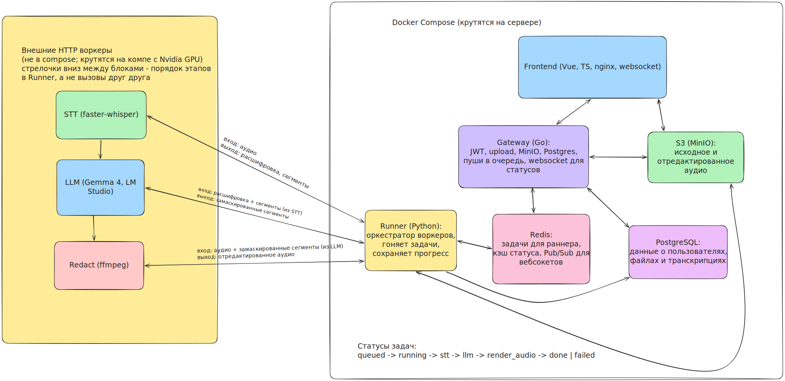

# Сервис анонимизации голосовых данных (Tulahack 2026)

Монорепозиторий: **сервер в Docker** (`backend/`: Go-шлюз + Python-runner), **Vue + TypeScript** фронтенд, **воркеры с моделями на ПК** (`workers/stt`,
`workers/llm`, `workers/redact`).

## Структура

| Каталог                               | Назначение                                                                   |
|---------------------------------------|------------------------------------------------------------------------------|
| [`backend/gateway`](backend/gateway/) | HTTP API на Go: загрузки, постановка в очередь, статусы                      |
| [`backend/runner`](backend/runner/)   | В Docker на сервере: Redis -> MinIO -> HTTP к STT/LLM/redact -> MinIO/Postgres |
| [`workers/stt`](workers/stt/)         | STT (распознание текста) `/v1/transcribe`                                    |
| [`workers/llm`](workers/llm/)         | LLM (фильтрация данных для анонимизации) `/v1/anonymize`                     |
| [`workers/redact`](workers/redact/)   | Redact (анонимизация аудио) `/v1/redact`                                     |
| [`frontend`](frontend/)               | Vue 3 + TypeScript + Router — см. [`frontend/README.md`](frontend/README.md) |

**Адреса воркеров:** `STT_BASE_URL`, `LLM_BASE_URL`, `REDACT_BASE_URL`, `WORKER_TOKEN` в env сервиса `runner` и на
стороне HTTP-сервисов.

## Быстрый старт (локально)

Требования: **Go 1.22+**, **Node.js 20+**. Модели и HTTP-воркеры — по README в `workers/`

```bash
# Терминал 1 — шлюз
cd backend/gateway && go run ./cmd/gateway

# TODO runner

# Терминал 2 — фронт
cd frontend && npm install && npm run dev
```

- Шлюз: `http://localhost:8080/health`, агрегат: `http://localhost:8080/api/v1/health`
- UI: `http://localhost:5173` (прокси `/api` → шлюз, см. `frontend/vite.config.ts`)

## Docker

```bash
docker compose up --build
```

Сервисы: **`web`** (nginx + статика Vue, порт **8081**), **`gateway`**, **`runner`**

## Демо проекта

TODO

## Архитектура

